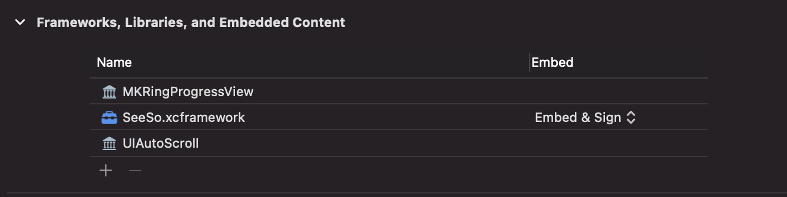
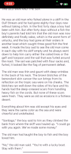

# UIAutoScroll Example App

[](https://developer.apple.com/)
[](https://en.wikipedia.org/wiki/MIT_License)
[](https://developer.apple.com/xcode/)
[](https://github.com/apple/swift)


## Requirements

- iOS real device.
- [SeeSo](https://seeso.io) License Key & [SeeSo](https://seeso.io) Framework.
- iOS 13.0 
- Network connected environment

## Build


1. After receiving the framework from [SeeSo](https://seeso.io), import it into the project. At this time, the embed & signing option is provided. See [document](https://docs.seeso.io) for details.




2. Get the dev key from [SeeSo Manage](https://manage.seeso.io) and put the key value in the license variable of ViewControl. 

```swift
  var license : String = "Input your key." 
```

## How to use the app

   

1. click start button.
2. Keep an eye on the center of the screen.  
3. If you read the text naturally, it scrolls little by little, and if you look at the bottom of the screen, it scrolls for a long time.


## Framework

### Manual

- [SeeSo](https://seeso.io) 

### Swift Package Manager
- [MKRingProgressView](https://github.com/maxkonovalov/MKRingProgressView)
- [UIAutoScroll](https://github.com/visualcamp/UIAutoScroll)

## License 

The MIT License (MIT)

Copyright (c) 2021 [SeeSo](https://seeso.io)
